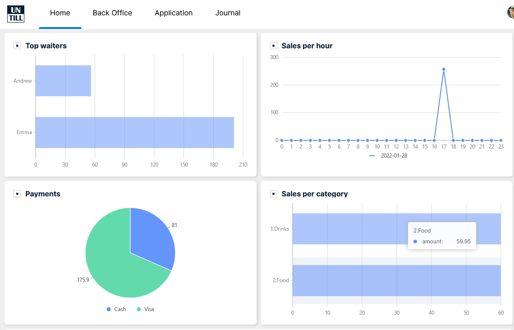

### Описание

Требуется реализовать Dashboard содержащий четыре графика:
 1. Продажи по типам оплаты (air.dailyPayments)
 2. Продажи по категориям (air.dailyCategories)
 3. Продажи по часам (air.hourlySales)
 4. Продажи по официантам (air.dailyWaiters)

### Требования
- Framework - ReactJS
- State managment - Redux: 
- Middleware framework - Redux Saga
- Сами графики разрабатывать не нужно, можно использовать готовые библиотеки типа Material UI.
- Внешний вид, структура, стилевые предпочтения - всё на усмотрение разработчика
- Тип используемых компонентов (классовые или функциональные) роли не играет
- Добавить некий переключатель для изменения данных Dashboard'a по какому-либо принципу, чтобы можно было наблюдать изменения в Dashboard. Например, это может быть некий input для ввода множителя, на который будут изменены числовые характеристики дашборда. 

### Under the hood

- Redux Saga эмулирует запрос к некоему API (Должен быть реализован соответствующий mock) для получения данных (response.json).
- Данные обрабатываются и сохраняются в State (Redux). Для "расшифровки" данных в response.json нужно использовать request.json.  
- Компонент дашборда получает изменения из state и выводит информацию в соответствующие графики.

### Real example

